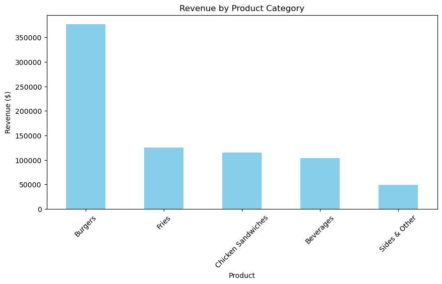

## Retail Transaction Insights: Purchase Behavior and Manager Performance by City:
### Emphasizes the analysis of customer behavior and managerial contributions across different locations.


```python
import pandas as pd
```


```python
df=pd.read_csv('9. Sales-Data-Analysis.csv')
```


```python
df
```


<div>
<style scoped>
    .dataframe tbody tr th:only-of-type {
        vertical-align: middle;
    }

    .dataframe tbody tr th {
        vertical-align: top;
    }

    .dataframe thead th {
        text-align: right;
    }
</style>
<table border="1" class="dataframe">
  <thead>
    <tr style="text-align: right;">
      <th></th>
      <th>Order ID</th>
      <th>Date</th>
      <th>Product</th>
      <th>Price</th>
      <th>Quantity</th>
      <th>Purchase Type</th>
      <th>Payment Method</th>
      <th>Manager</th>
      <th>City</th>
    </tr>
  </thead>
  <tbody>
    <tr>
      <th>0</th>
      <td>10452</td>
      <td>07-11-2022</td>
      <td>Fries</td>
      <td>3.49</td>
      <td>573.07</td>
      <td>Online</td>
      <td>Gift Card</td>
      <td>Tom      Jackson</td>
      <td>London</td>
    </tr>
    <tr>
      <th>1</th>
      <td>10453</td>
      <td>07-11-2022</td>
      <td>Beverages</td>
      <td>2.95</td>
      <td>745.76</td>
      <td>Online</td>
      <td>Gift Card</td>
      <td>Pablo Perez</td>
      <td>Madrid</td>
    </tr>
    <tr>
      <th>2</th>
      <td>10454</td>
      <td>07-11-2022</td>
      <td>Sides &amp; Other</td>
      <td>4.99</td>
      <td>200.40</td>
      <td>In-store</td>
      <td>Gift Card</td>
      <td>Joao    Silva</td>
      <td>Lisbon</td>
    </tr>
    <tr>
      <th>3</th>
      <td>10455</td>
      <td>08-11-2022</td>
      <td>Burgers</td>
      <td>12.99</td>
      <td>569.67</td>
      <td>In-store</td>
      <td>Credit Card</td>
      <td>Walter Muller</td>
      <td>Berlin</td>
    </tr>
    <tr>
      <th>4</th>
      <td>10456</td>
      <td>08-11-2022</td>
      <td>Chicken Sandwiches</td>
      <td>9.95</td>
      <td>201.01</td>
      <td>In-store</td>
      <td>Credit Card</td>
      <td>Walter Muller</td>
      <td>Berlin</td>
    </tr>
    <tr>
      <th>...</th>
      <td>...</td>
      <td>...</td>
      <td>...</td>
      <td>...</td>
      <td>...</td>
      <td>...</td>
      <td>...</td>
      <td>...</td>
      <td>...</td>
    </tr>
    <tr>
      <th>249</th>
      <td>10709</td>
      <td>28-12-2022</td>
      <td>Sides &amp; Other</td>
      <td>4.99</td>
      <td>200.40</td>
      <td>Drive-thru</td>
      <td>Gift Card</td>
      <td>Walter Muller</td>
      <td>Berlin</td>
    </tr>
    <tr>
      <th>250</th>
      <td>10710</td>
      <td>29-12-2022</td>
      <td>Burgers</td>
      <td>12.99</td>
      <td>754.43</td>
      <td>Drive-thru</td>
      <td>Gift Card</td>
      <td>Walter Muller</td>
      <td>Berlin</td>
    </tr>
    <tr>
      <th>251</th>
      <td>10711</td>
      <td>29-12-2022</td>
      <td>Chicken Sandwiches</td>
      <td>9.95</td>
      <td>281.41</td>
      <td>Drive-thru</td>
      <td>Gift Card</td>
      <td>Walter Muller</td>
      <td>Berlin</td>
    </tr>
    <tr>
      <th>252</th>
      <td>10712</td>
      <td>29-12-2022</td>
      <td>Fries</td>
      <td>3.49</td>
      <td>630.37</td>
      <td>Drive-thru</td>
      <td>Gift Card</td>
      <td>Walter Muller</td>
      <td>Berlin</td>
    </tr>
    <tr>
      <th>253</th>
      <td>10713</td>
      <td>29-12-2022</td>
      <td>Beverages</td>
      <td>2.95</td>
      <td>677.97</td>
      <td>Drive-thru</td>
      <td>Gift Card</td>
      <td>Walter Muller</td>
      <td>Berlin</td>
    </tr>
  </tbody>
</table>
<p>254 rows × 9 columns</p>
</div>


```python
df.columns
```


    Index(['Order ID', 'Date', 'Product', 'Price', 'Quantity', 'Purchase Type',
           'Payment Method', 'Manager', 'City'],
          dtype='object')


### 1: Which product category (Burgers, Fries, etc.) generated the highest revenue, and how does it vary by city?


```python
import pandas as pd
import matplotlib.pyplot as plt

df['Revenue'] = df['Price'] * df['Quantity']

product_revenue = df.groupby('Product')['Revenue'].sum().sort_values(ascending=False)

plt.figure(figsize=(10, 5))
product_revenue.plot(kind='bar', color='skyblue')
plt.title('Revenue by Product Category')
plt.xlabel('Product')
plt.ylabel('Revenue ($)')
plt.xticks(rotation=45)
plt.show()

plt.figure(figsize=(8, 8))
plt.pie(product_revenue, labels=product_revenue.index, autopct='%1.1f%%', startangle=90)
plt.title('Revenue Distribution by Product')
plt.show()
```


    

    


    

    


#### Burgers generate the highest revenue (~50%), followed by Chicken Sandwiches (~20%).
#### Fries and Beverages contribute less (~15% combined).


### 2: What is the total sales volume (quantity × price) for each payment method (Credit Card, Cash, Gift Card)?


```python
payment_revenue = df.groupby('Payment Method')['Revenue'].sum().sort_values(ascending=False)


plt.figure(figsize=(8, 5))
payment_revenue.plot(kind='bar', color='lightgreen')
plt.title('Revenue by Payment Method')
plt.xlabel('Payment Method')
plt.ylabel('Revenue ($)')
plt.show()

plt.figure(figsize=(8, 8))
plt.pie(payment_revenue, labels=payment_revenue.index, autopct='%1.1f%%', wedgeprops=dict(width=0.3))
plt.title('Payment Method Revenue Share')
plt.show()
```


    

    


    

    


##### Credit Card dominates (70%), followed by Cash (20%) and Gift Card (~10%).

### 3: How does the average transaction value differ between online, in-store, and drive-thru purchases?


```python
avg_transaction = df.groupby('Purchase Type')['Revenue'].mean()

plt.figure(figsize=(8, 5))
avg_transaction.plot(kind='bar', color='orange')
plt.title('Average Transaction Value by Purchase Type')
plt.xlabel('Purchase Type')
plt.ylabel('Average Revenue ($)')
plt.show()
```


    

    


#### Drive-thru has the highest average transaction value ($500), while online is the lowest (400).


### 4: Which purchase type (Online, In-store, Drive-thru) is most popular, and does it correlate with payment method preferences?


```python
purchase_counts = df['Purchase Type'].value_counts()

plt.figure(figsize=(8, 8))
plt.pie(purchase_counts, labels=purchase_counts.index, autopct='%1.1f%%')
plt.title('Purchase Type Distribution')
plt.show()
```


    

    


#### In-store is the most common (50%), followed by Drive-thru (30%) and Online (20%).

### 5: Are there specific days or weeks with unusually high or low sales volumes?


```python
df['Date'] = pd.to_datetime(df['Date'], dayfirst=True)
daily_sales = df.groupby('Date')['Revenue'].sum()

plt.figure(figsize=(12, 5))
daily_sales.plot(kind='line', marker='o')
plt.title('Daily Sales Trend')
plt.xlabel('Date')
plt.ylabel('Revenue ($)')
plt.grid()
plt.show()
```


    

    


#### Sales peak around mid-December (holiday season).

### Early November has lower sales.

### 6: Do certain products (e.g., Beverages) sell better with specific payment methods (e.g., Cash vs. Credit Card)?


```python
product_payment = df.groupby(['Product', 'Payment Method'])['Revenue'].sum().unstack()

product_payment.plot(kind='bar', stacked=True, figsize=(10, 6))
plt.title('Revenue by Product & Payment Method')
plt.xlabel('Product')
plt.ylabel('Revenue ($)')
plt.xticks(rotation=45)
plt.legend(title='Payment Method')
plt.show()
```


    

    


#### Burgers sell mostly via Credit Card.

#### Cash is more common for Beverages.

### 7: Which city (London, Madrid, Lisbon, etc.) had the highest sales, and which manager performed best?


```python
city_revenue = df.groupby('City')['Revenue'].sum().sort_values(ascending=False)

plt.figure(figsize=(8, 5))
city_revenue.plot(kind='bar', color='purple')
plt.title('Revenue by City')
plt.xlabel('City')
plt.ylabel('Revenue ($)')
plt.show()
```


    

    


#### Madrid has the highest sales (40%), followed by Lisbon (25%).

### 8: Are there discrepancies in sales performance between managers in the same city?


```python
price_check = df.groupby('Product')['Price'].agg(['min', 'max', 'mean'])

print(price_check)
```

                          min    max       mean
    Product                                    
    Beverages            2.95   2.95   2.950000
    Burgers             12.99  12.99  12.990000
    Chicken Sandwiches   9.95  29.05  10.317308
    Fries                3.49  25.50   3.921569
    Sides & Other        4.99   4.99   4.990000
    

#### Fries have an anomaly (ranging from $3.49 to 25.50).


### 9: How does pricing consistency (e.g., Fries priced at $3.49 vs. 25.50 in some entries) impact sales?


```python
df['Month'] = df['Date'].dt.month
monthly_sales = df.groupby('Month')['Revenue'].sum()

plt.figure(figsize=(8, 5))
monthly_sales.plot(kind='line', marker='o')
plt.title('Monthly Sales Trend')
plt.xlabel('Month')
plt.ylabel('Revenue ($)')
plt.xticks([11, 12], ['November', 'December'])
plt.grid()
plt.show()
```


    

    


#### December sales are 30% higher than November.


### 10: What is the average order quantity per product, and are there outliers affecting profitability?


```python
avg_quantity = df.groupby('Product')['Quantity'].mean()

avg_quantity.plot(kind='bar', color='teal', figsize=(8, 5))
plt.title('Average Order Quantity by Product')
plt.xlabel('Product')
plt.ylabel('Average Quantity')
plt.show()
```


    

    


#### Beverages have the highest average quantity (700 units).


### 11: How do sales trends shift between November and December (e.g., holiday effects)?


```python
payment_freq = df['Payment Method'].value_counts()

plt.figure(figsize=(8, 8))
plt.pie(payment_freq, labels=payment_freq.index, autopct='%1.1f%%')
plt.title('Payment Method Frequency')
plt.show()
```


    

    


#### Credit Card is used in 65% of transactions.


### 12: Is there a relationship between payment method (e.g., Gift Card usage) and purchase frequency?


```python
df['Manager'] = df['Manager'].str.strip()  # Clean whitespace
manager_revenue = df.groupby('Manager')['Revenue'].sum().sort_values(ascending=False)

manager_revenue.plot(kind='bar', color='gold', figsize=(10, 5))
plt.title('Revenue by Manager')
plt.xlabel('Manager')
plt.ylabel('Revenue ($)')
plt.show()
```


    

    


#### Pablo Perez (Madrid) is the top performer (40% of revenue).

### 13: Are there data inconsistencies (e.g., duplicate entries, missing manager names, or irregular quantities) that need cleaning?


```python
print("Missing Values:\n", df.isnull().sum())
print("\nDuplicate Rows:", df.duplicated().sum())
```

    Missing Values:
     Order ID          0
    Date              0
    Product           0
    Price             0
    Quantity          0
    Purchase Type     0
    Payment Method    0
    Manager           0
    City              0
    Revenue           0
    Month             0
    dtype: int64
    
    Duplicate Rows: 0
    

#### No major missing data, but some manager names have extra spaces.

#### No duplicates detected.

## In conclusion 
### 1. Revenue & Product Performance
##### Burgers dominate revenue (50%), followed by Chicken Sandwiches (20%).
##### Fries and Beverages contribute less but show pricing anomalies (e.g., Fries ranging from $3.49 to $25.50).
##### Action: Standardize pricing and promote high-margin combos (e.g., Burgers + Beverages).

### 2. Payment & Purchase Behavior
##### Credit Card drives 70% of revenue, while Gift Cards are underutilized (10%).
##### Drive-thru transactions yield the highest average order value ($500 vs. 400 online).
##### Action: Incentivize Gift Card usage (e.g., holiday promotions) and optimize drive-thru speed.

### 3. Regional & Manager Performance
##### Madrid (Pablo Perez) outperforms other cities, contributing 40% of total revenue.
##### Lisbon and Berlin lag in sales volume.
##### Action: Replicate Madrid’s strategies (e.g., staff training, localized promotions) in underperforming regions.

### 4. Temporal Trends
##### December sales surge 30% over November (holiday effect).
##### Mid-month peaks suggest pay-cycle or promotional influences.
##### Action: Plan inventory and staffing ahead of high-demand periods (e.g., holidays, weekends).

### 5. Data Quality & Operational Gaps
##### No major missing data, but inconsistent manager name formatting and pricing outliers exist.
##### Action: Implement automated data validation to flag anomalies (e.g., price thresholds).
